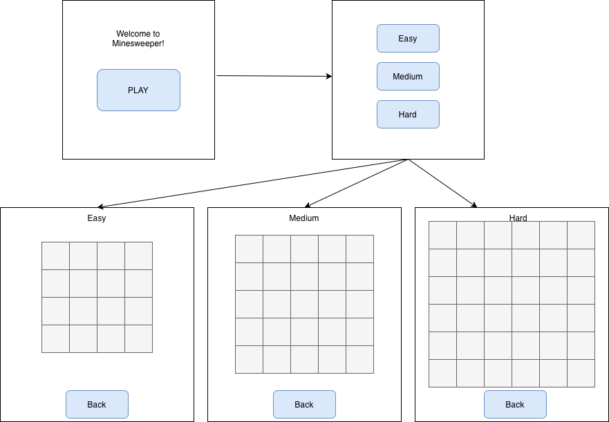
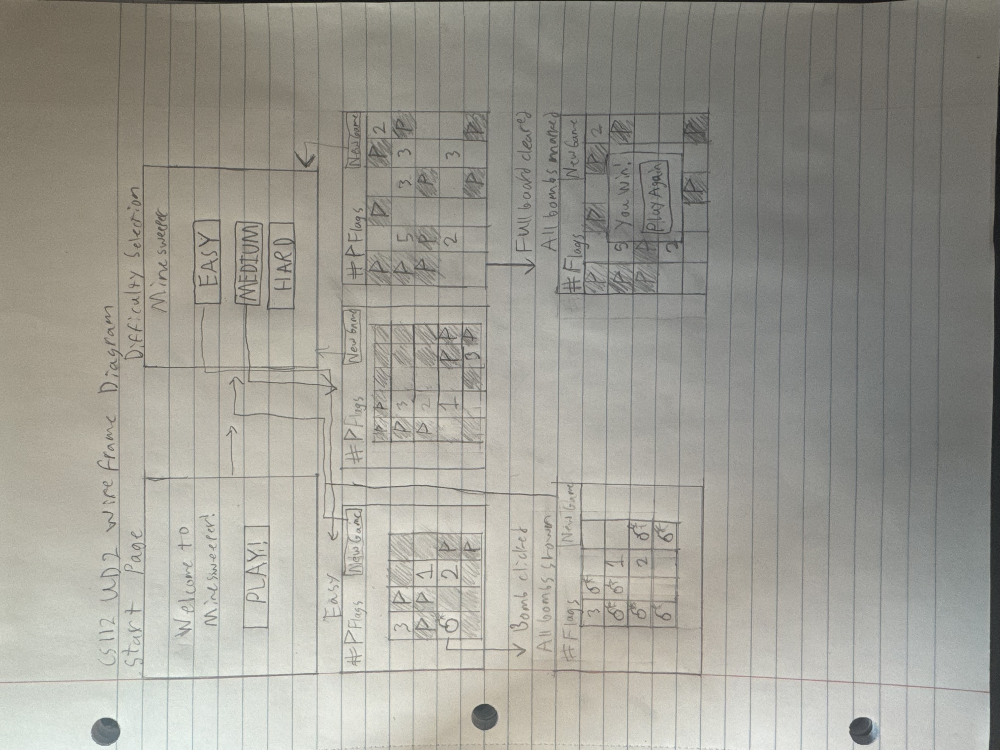
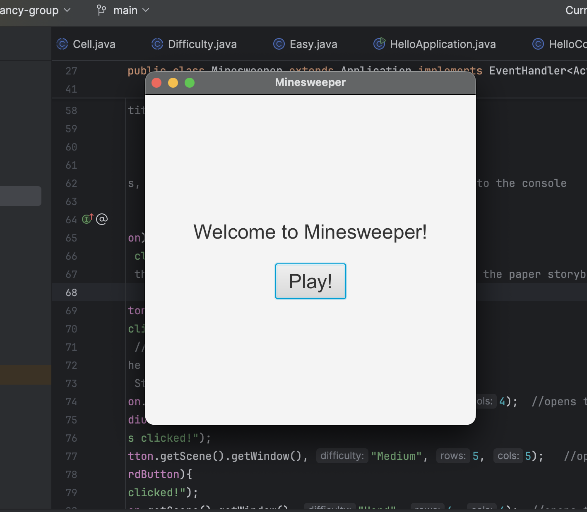
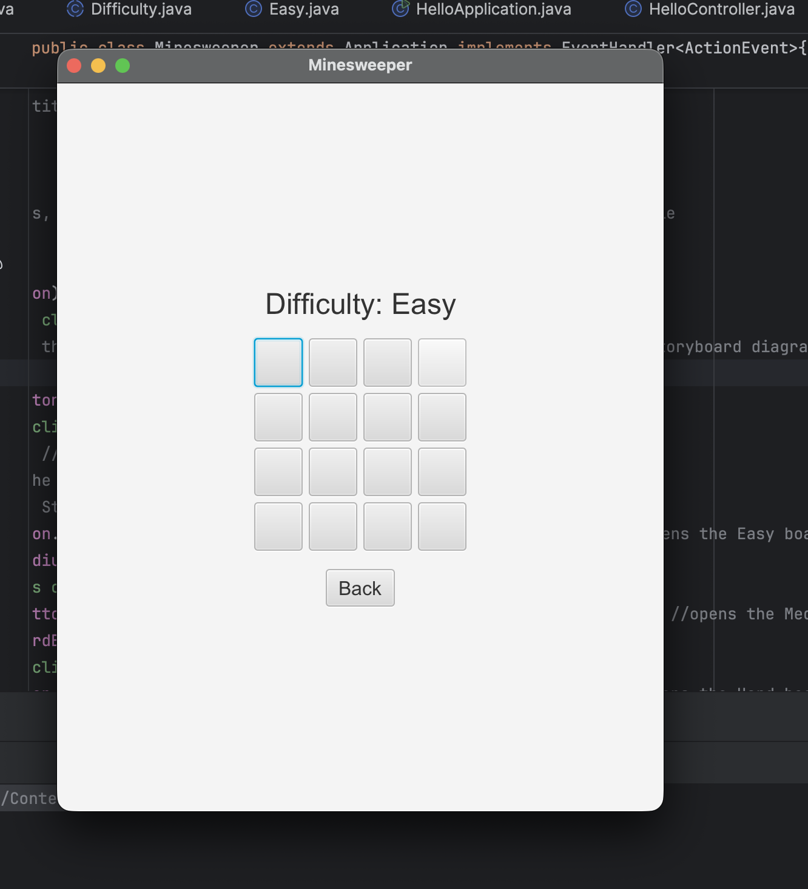
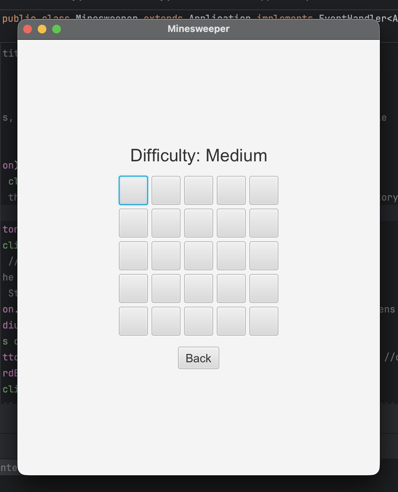
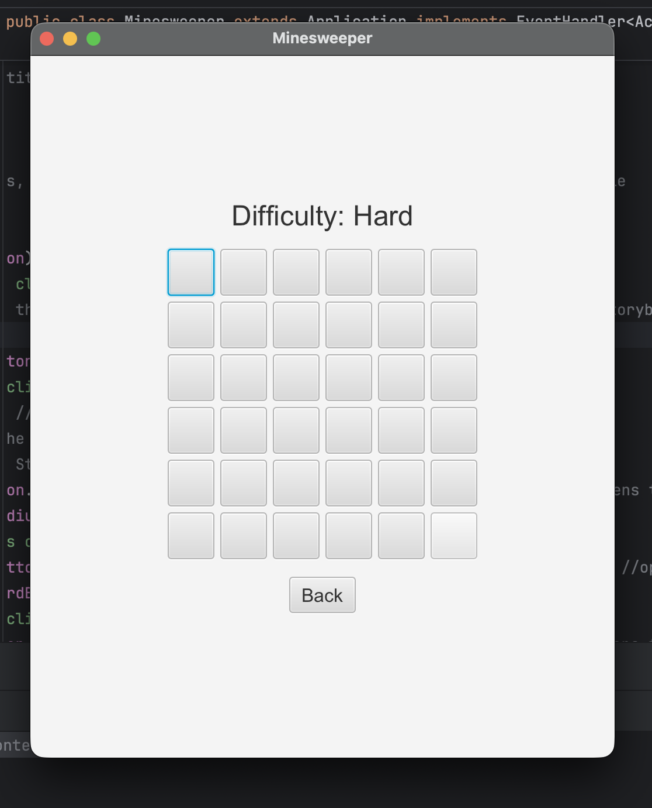

Jeff Peterson, Noah Shew, Drew Sullivan  

# Unit Deliverable 2 – Final Project GUI

This project builds the Minesweeper GUI using JavaFX.  
It includes a start screen, a difficulty selection screen, and a working board display that changes size with difficulty.  

### **Minesweeper Class Overview**  
This class acts as the main driver for the rest of the program, being the “home base” of the GUI components.  
It sets up the start page, then moves to the difficulty page when the Play button is clicked.  
When a difficulty button is selected, it prints data from the related model class (Easy, Medium, Hard) and loads the board layout.  

### **BoardGUI Class Overview**  
The `BoardGUI` class builds the main Minesweeper board screen.  
It creates a grid of clickable buttons representing cells.  
Each cell prints its coordinates when clicked.  
The board automatically scales based on difficulty:
- Easy → 4×4  
- Medium → 5×5  
- Hard → 6×6  

A Back button returns the user to the start screen.  
This setup connects directly to the Minesweeper class but is ready to integrate with the model (`Board`, `Cell`, and `Difficulty`) in the next unit.

### **Current Features**
- Buttons switch between scenes correctly  
- Board size changes with difficulty  
- Each cell is clickable  
- Back button works  

### **Next Steps**
- Connect the `Board` and `Cell` classes  
- Add flagging and reveal logic  
- Implement win/loss conditions

## GUI and Wireframe
### wireframe  

### Start Screen  

## Difficulty Screen
[Difficulty](Difficulty.png)

### Board Screens
**Easy**  

**Medium**  

**Hard**  

